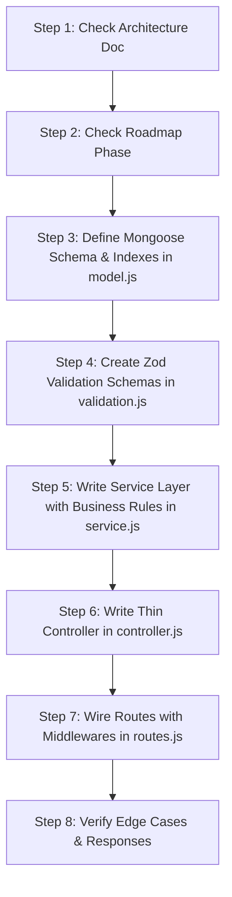

# 🤖 AI Backend Development Workflow & Operating Protocol
**Project:** Coaching Management System — Single Institute Backend  
**Reference Document:** [`coaching-backend-architecture.md`](./coaching-backend-architecture.md)  
**Target Tech Stack:** Node.js, Express.js, JavaScript, MongoDB (Mongoose), Zod, JWT

---

> ### ⚠️ MANDATORY AI DIRECTIVE (सर्वोपरि नियम)
> **ANY AI AGENT, LLM, OR DEVELOPER WORKING IN THIS REPOSITORY MUST READ THIS FILE AND [`coaching-backend-architecture.md`](./coaching-backend-architecture.md) BEFORE GENERATING OR MODIFYING ANY CODE.**
>
> 1. **DO NOT deviate from the architecture document.** All schemas, endpoints, response envelopes, and business logic must strictly match.
> 2. **ALL backend files must be written in JavaScript (`.js`) — DO NOT create `.ts` files.**
> 3. **DO NOT invent unnecessary abstractions, microservices, or queue layers** prematurely. Keep it a clean **Modular Monolith**.
> 4. **DO NOT bypass security, RBAC permissions, or validation layers.**
> 5. **Always follow the Phase-by-Phase implementation roadmap.**

---

## 1. Core Architecture & Tech Stack Rules

| Component | Standard Choice | Strict Rule |
|---|---|---|
| **Runtime & Language** | Node.js + JavaScript (ES6+) | All source code in `.js`. Clean, modern JavaScript syntax. |
| **Framework** | Express.js | Use modular router per domain module. |
| **Database & ODM** | MongoDB + Mongoose | Define explicit schemas and indexes (unique/compound/TTL). |
| **Authentication** | JWT (15 min access) + Refresh Token | Store refresh token hashes in `sessions` collection with TTL. |
| **Authorization** | RBAC + Permission Middleware | Format: `module.action` (e.g., `student.create`, `fees.read`). |
| **Request Validation** | Zod | Validate `body`, `query`, and `params` before controller execution. |
| **Error Handling** | Custom `AppError` + Centralized Middleware | Never leak stack traces in production; standardize error JSON. |
| **Response Wrapper** | Unified JSON Envelope | Always return `{ success: true, message, data }`. |
| **File Storage** | AWS S3 / Cloudflare R2 | Only file URLs and storage keys stored in MongoDB, never raw blobs. |
| **Payments** | Razorpay | Verification strictly on backend; use MongoDB Transactions for payment + invoice updates. |

---

## 2. Directory & Module Blueprint

Every domain module in `src/modules/<module-name>/` must strictly follow this file structure (all `.js` files):

```text
src/
├── config/                  # Database, env vars, S3/R2, Razorpay config
│   ├── database.js
│   ├── env.js
│   ├── storage.js
│   └── razorpay.js
│
├── modules/
│   └── <module-name>/       # e.g., auth, students, teachers, fees, attendance
│       ├── controller.js    # Thin HTTP handler (req/res), calls service, returns standard JSON
│       ├── service.js       # Pure business logic, DB queries, transactions
│       ├── routes.js        # Route definitions with auth, permission & validation middleware
│       ├── validation.js    # Zod schemas for body, query, and params
│       └── model.js         # Mongoose schema, model definition, and indexes
│
├── middleware/
│   ├── auth.middleware.js       # JWT verification & populates req.user
│   ├── permission.middleware.js # checkPermission("module.action")
│   ├── validation.middleware.js # Zod validator middleware
│   ├── upload.middleware.js     # Multer S3/R2 handler
│   ├── rateLimit.middleware.js  # Express rate limiting
│   └── error.middleware.js      # Global centralized error handler
│
├── common/
│   ├── constants/           # Roles, HTTP status codes, error codes
│   ├── utils/               # JWT helper, hash helper, response formatters
│   ├── errors/              # AppError class
│   └── helpers/             # Shared helpers
│
├── routes/
│   └── index.js             # Central root router mounting /api/v1/<module>
│
├── app.js                   # Express app setup, middleware, routes
└── server.js                # Server bootstrap, DB connection, graceful shutdown
```

---

## 3. Step-by-Step AI Execution Workflow

Whenever the user asks you to implement a feature, module, or fix, you must follow this 7-step sequence:



### Step 1: Read the Architecture Document
- Open `coaching-backend-architecture.md`.
- Read the specific section corresponding to the module (e.g., Section 8 for Students, Section 13 for Fees).
- Extract:
  - Exact collection name and schema fields
  - Exact index requirements (unique, compound, TTL)
  - Defined REST API endpoints and HTTP methods
  - Role access boundaries

### Step 2: Check Roadmap Phase
- Check Section 25 (**MVP Development Order**):
  - **Phase 1:** Auth, Users, Roles, Permissions, Students, Teachers, Courses, Batches, Enrollments
  - **Phase 2:** Student Attendance, Teacher Attendance, Fees, Invoices, Payments, Receipts
  - **Phase 3:** Question Bank, MCQ Tests, Attempts, Results
  - **Phase 4:** Competitions, Registration, Competition Payments
  - **Phase 5:** Announcements, Notifications
  - **Phase 6:** Teacher Payroll, Salary, Reports, Dashboard, Audit Logs
- Never jump ahead and create Phase 6 features if Phase 1 dependencies are not yet present.

### Step 3: Define Model (`model.js`)
- Include all fields specified in the schema.
- **NEVER embed unbounded arrays** (e.g., do not store attendance or payment history inside student document).
- Set required indexes:
  - Unique keys: e.g. `studentCode`, `teacherCode`, `email`, `invoiceNumber`
  - Compound keys: e.g. `attendance (userType + userId + batchId + date)`
  - TTL keys: e.g. `sessions (expiresAt)`

### Step 4: Write Zod Validation (`validation.js`)
- Validate every request parameter:
  - `params`: check `ObjectId` format regex
  - `query`: validate pagination `page` (default 1), `limit` (default 20, max 100), filters
  - `body`: validate required fields, formats (email, phone), enums

### Step 5: Implement Business Logic in Service (`service.js`)
- Services handle all database calls.
- Controllers **never** import Mongoose models directly.
- Use MongoDB Transactions for multi-document operations (e.g., updating invoice status when payment succeeds).
- Throw `AppError(statusCode, message, errorCode)` on failures.

### Step 6: Write Controller (`controller.js`)
- Controllers must be **thin**:
  ```javascript
  export const getStudents = async (req, res, next) => {
    try {
      const result = await studentService.listStudents(req.query);
      return res.status(200).json({
        success: true,
        data: result.data,
        pagination: result.pagination
      });
    } catch (error) {
      next(error);
    }
  };
  ```

### Step 7: Wire Routes & Permissions (`routes.js`)
- Protect private routes with `authenticate`.
- Protect role actions with `checkPermission("module.action")`.
- Attach `validateRequest(schema)` middleware.

---

## 4. Non-Negotiable Coding Standards

### A. API Response Envelope
Every API response must strictly follow Section 21:

```json
// Success Response
{
  "success": true,
  "message": "Student created successfully",
  "data": {}
}

// Paginated List Response
{
  "success": true,
  "data": [],
  "pagination": {
    "page": 1,
    "limit": 20,
    "total": 500,
    "totalPages": 25
  }
}

// Error Response (via centralized error handler)
{
  "success": false,
  "message": "Validation failed",
  "code": "VALIDATION_ERROR",
  "errors": [{ "field": "email", "message": "Invalid email format" }]
}
```

### B. Security & Self-Service Rule (Critical)
- **Students & Self-Service Endpoints (`/api/v1/me/*`):**
  - Always extract the identity from `req.user.id` (set by JWT auth middleware).
  - **NEVER** accept a `studentId` or `userId` in the request body or query parameter for self-service routes!
  - Students cannot call admin list routes (`/students`, `/teachers`, `/payroll`, `/payments`).

### C. Financial & Transaction Integrity
- Payments must be verified on the backend with Razorpay signature verification (`crypto.createHmac`).
- Creation of a payment record and updating invoice status to `PAID` **MUST** occur inside a MongoDB session transaction:
  ```javascript
  const session = await mongoose.startSession();
  session.startTransaction();
  try {
    // 1. Create Payment record
    // 2. Update Invoice status to PAID
    // 3. Create Audit Log
    await session.commitTransaction();
  } catch (err) {
    await session.abortTransaction();
    throw err;
  } finally {
    session.endSession();
  }
  ```
- Support `Idempotency-Key` header on sensitive payment operations.

### D. Audit Logging
Every sensitive action must trigger an entry in `auditLogs`:
`LOGIN`, `LOGOUT`, `STUDENT_CREATED`, `STUDENT_DELETED`, `FEE_CREATED`, `PAYMENT_CREATED`, `PAYMENT_REFUNDED`, `TEACHER_CREATED`, `SALARY_PAID`, `TEST_PUBLISHED`, `COMPETITION_CREATED`.

---

## 5. AI Quality Checklist Before Delivering Any Code

Before marking any task as complete, the AI must verify:

- [ ] All code files created use `.js` extension (NO `.ts` files).
- [ ] Has [`coaching-backend-architecture.md`](./coaching-backend-architecture.md) been verified for the exact fields and route paths?
- [ ] Are all Mongoose indexes declared in the schema (unique/compound)?
- [ ] Is input validation using Zod attached to the route?
- [ ] Are controllers kept thin with zero direct database queries?
- [ ] Is error handling delegating to `next(error)` with `AppError`?
- [ ] Are responses wrapped in `{ success: true, ... }` standard format?
- [ ] Are pagination limits enforced (never unbounded find queries)?
- [ ] Is JavaScript clean and error-free?
